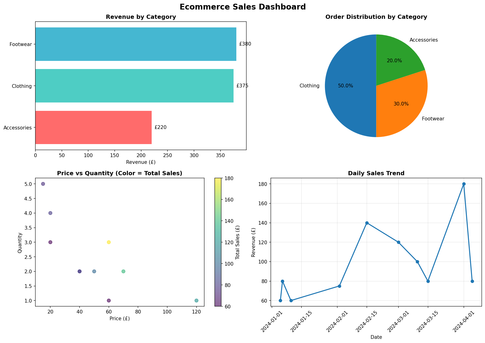
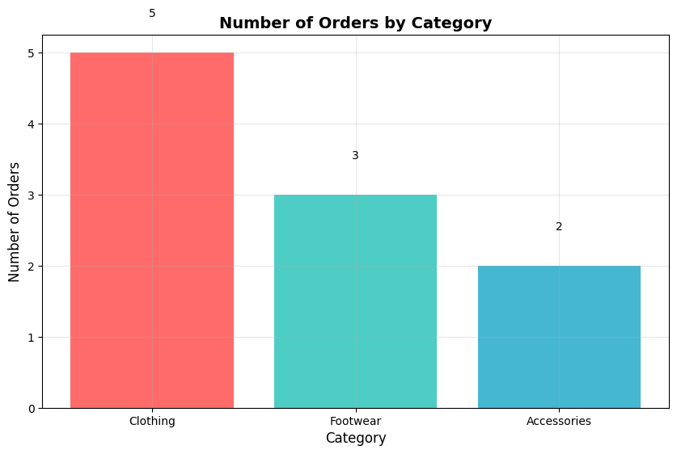
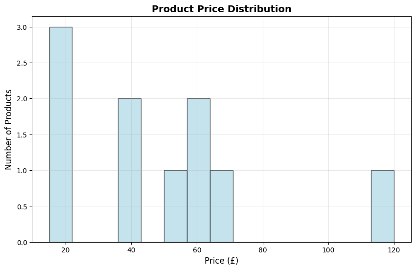

# 🛍️ Ecommerce Sales Analysis

## 📌 Project Overview
Complete analysis of ecommerce sales data with revenue trends, category performance, and product insights.

## 📊 Key Insights
| Metric | Value |
|--------|-------|
| **Total Revenue** | £975.00 |
| **Average Order Value** | £97.50 |
| **Top Category** | Footwear (38.97%) |
| **Best Product** | Shoes (£240) |

## 📈 Visualizations

### Main Dashboard


### Category Analysis


### Price Distribution


## 🛠️ Tech Stack
- Python 3.13
- Pandas (Data manipulation)
- Matplotlib (Visualization)

## 📁 Output Files
| File | Description |
|------|-------------|
| `sales_report.txt` | Summary report |
| `category_analysis.csv` | Category breakdown |
| `ecommerce_dashboard.png` | 4-in-1 dashboard |

## 🚀 Run Locally
```bash
git clone https://github.com/aftab-analytics/ecommerce-sales-analysis.git
cd ecommerce-sales-analysis
pip install pandas matplotlib
python analysis.py
